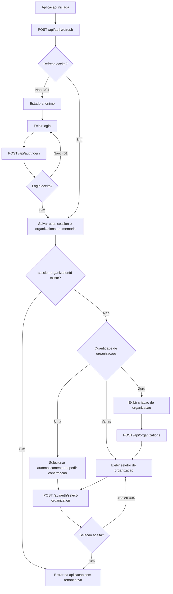
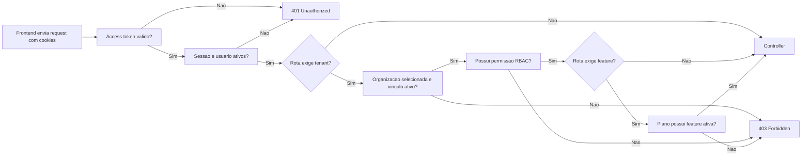
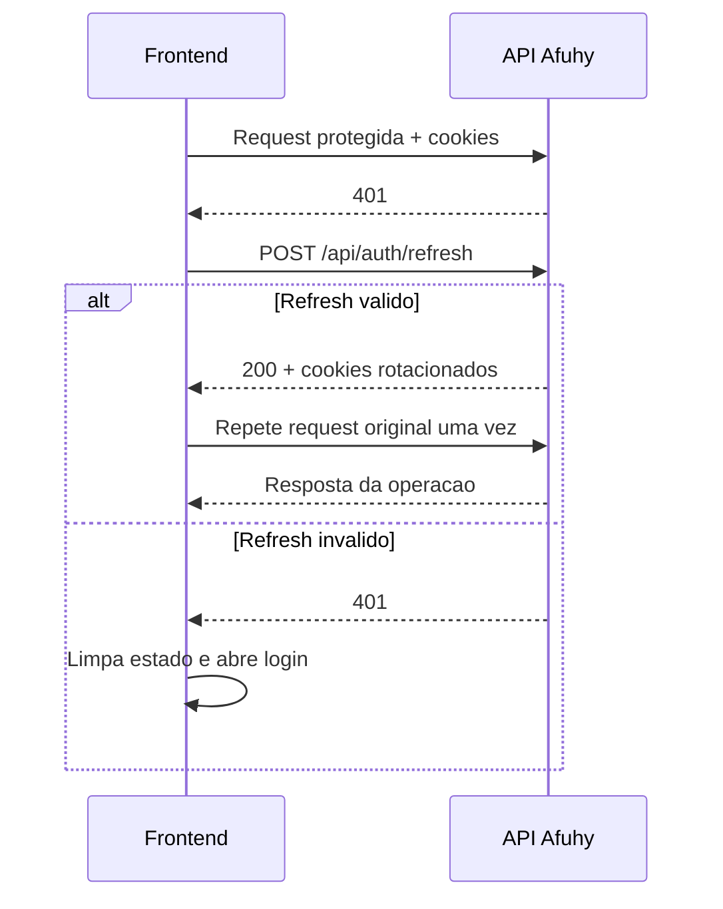
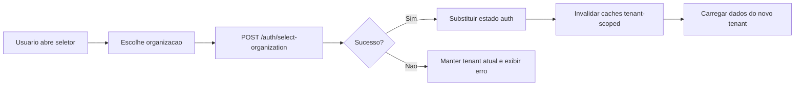
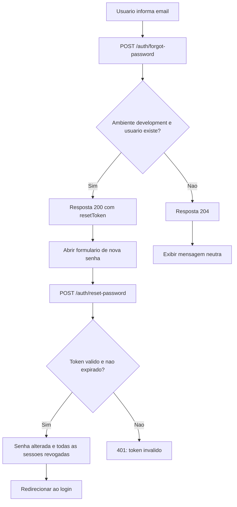

# Guia de Autenticacao para o Frontend

Este documento descreve como o frontend deve integrar com a autenticacao da
Afuhy. A API usa access token e refresh token exclusivamente em cookies
`httpOnly`.

## Principios

- Todas as requisicoes devem enviar cookies com `credentials: 'include'`.
- O frontend nao deve ler, persistir ou enviar tokens manualmente.
- Nao armazenar access token ou refresh token em `localStorage`,
  `sessionStorage` ou estado global.
- O access token identifica usuario, sessao e organizacao selecionada.
- O refresh token e rotacionado em login, refresh e selecao de organizacao.
- Uma resposta `401` pode iniciar uma tentativa de refresh.
- Uma resposta `403` representa falta de organizacao, vinculo, permissao,
  feature ou limite do plano. Nao deve iniciar refresh.

## Cookies

| Cookie | Uso | Path |
| --- | --- | --- |
| `afuhy_access_token` | Autenticacao das rotas protegidas | `/` |
| `afuhy_refresh_token` | Renovacao e troca do tenant ativo | `/api/auth` |

Ambos sao `httpOnly`, `sameSite=lax` e usam a configuracao de seguranca do
ambiente. O JavaScript do navegador nao consegue acessar seus valores.

## Fluxo Principal



## Login

```http
POST /api/auth/login
Content-Type: application/json

{
  "email": "admin@afuhy.com.br",
  "password": "senha-segura"
}
```

Resposta:

```json
{
  "user": {
    "id": "uuid",
    "name": "Admin",
    "email": "admin@afuhy.com.br",
    "status": "ACTIVE"
  },
  "session": {
    "id": "uuid",
    "organizationId": null,
    "expiresAt": "2026-06-25T12:00:00.000Z"
  },
  "organizations": []
}
```

Em `development`, a resposta tambem pode conter `tokens`. Eles existem apenas
para depuracao e devem ser ignorados pelo frontend.

Depois do login, ainda nao existe tenant ativo. Rotas tenant-scoped exigem uma
organizacao selecionada.

## Selecao de Organizacao

```http
POST /api/auth/select-organization
Content-Type: application/json

{
  "organizationId": "uuid"
}
```

Essa operacao:

1. valida o refresh token;
2. valida se a organizacao esta ativa;
3. valida o vinculo ativo do usuario;
4. atualiza a sessao;
5. rotaciona os cookies;
6. retorna `session.organizationId` preenchido.

O frontend deve substituir o estado de autenticacao pela resposta completa.

## Requisicoes Protegidas



Exemplo com `fetch`:

```ts
const response = await fetch(`${API_URL}/api/users`, {
    credentials: 'include',
})
```

## Renovacao Automatica

Quando uma rota protegida responder `401`, o cliente pode tentar renovar a
sessao uma unica vez.



Como o refresh token e rotacionado, requisicoes simultaneas nao devem disparar
varios refreshes. Use uma unica Promise compartilhada:

```ts
let refreshPromise: Promise<boolean> | null = null

async function refreshSession(): Promise<boolean> {
    if (!refreshPromise) {
        refreshPromise = fetch(`${API_URL}/api/auth/refresh`, {
            method: 'POST',
            credentials: 'include',
        })
            .then(async (response) => {
                if (!response.ok) return false

                const auth = await response.json()
                authStore.set(auth)
                return true
            })
            .finally(() => {
                refreshPromise = null
            })
    }

    return refreshPromise
}
```

Regras do interceptor:

- nao tentar refresh quando a propria rota `/auth/refresh` retornar `401`;
- repetir a requisicao original no maximo uma vez;
- compartilhar o refresh entre requisicoes concorrentes;
- limpar o estado local se o refresh falhar;
- nao tentar refresh para respostas `403`.

## Bootstrap da Aplicacao

Nao existe endpoint `/me` nesta fase. Use o refresh para restaurar a sessao:

```ts
async function bootstrapAuth() {
    const response = await fetch(`${API_URL}/api/auth/refresh`, {
        method: 'POST',
        credentials: 'include',
    })

    if (response.status === 401) {
        authStore.clear()
        return
    }

    if (!response.ok) {
        throw new Error('Falha ao restaurar a sessao')
    }

    authStore.set(await response.json())
}
```

Enquanto o bootstrap estiver em andamento, mantenha a navegacao protegida em
estado de carregamento para evitar redirecionamento prematuro ao login.

## Troca de Organizacao



Ao trocar de organizacao, invalide dados como usuarios, membros, clientes,
fornecedores, billing e financeiro. Dados de tenants diferentes nunca devem
permanecer misturados no cache do frontend.

## Logout

```http
POST /api/auth/logout
```

A API tenta revogar a sessao e limpa os dois cookies. O frontend deve limpar o
estado e os caches locais mesmo se a chamada falhar por indisponibilidade de
rede.

## Recuperacao de Senha



O token expira em 30 minutos e so pode ser usado uma vez. Em producao, a
resposta de `forgot-password` nao revela se o email existe.

## Convites

O aceite do convite e publico:

```http
POST /api/auth/invitations/accept
Content-Type: application/json

{
  "token": "token-do-convite",
  "name": "Novo Usuario",
  "password": "senha-segura"
}
```

- Para usuario existente, `name` e `password` sao ignorados.
- Para email ainda nao cadastrado, ambos sao obrigatorios.
- O aceite nao autentica automaticamente.
- Depois do `204`, redirecione o usuario para o login.

## Sessoes e Senha

| Acao | Endpoint | Resultado |
| --- | --- | --- |
| Listar sessoes | `GET /auth/sessions` | Retorna sessoes ativas |
| Revogar uma sessao | `DELETE /auth/sessions/:id` | Revoga sessao do usuario |
| Revogar outras | `DELETE /auth/sessions/others` | Preserva a sessao atual |
| Trocar senha | `POST /auth/change-password` | Preserva a atual e revoga as demais |
| Resetar senha | `POST /auth/reset-password` | Revoga todas as sessoes |

Se a sessao atual for revogada, a proxima rota protegida respondera `401`.

## Tratamento de Status

| Status | Interpretacao no frontend |
| --- | --- |
| `200` / `201` | Atualizar estado com a resposta |
| `204` | Operacao concluida sem corpo |
| `400` | Exibir erros de validacao |
| `401` | Tentar refresh uma vez; depois abrir login |
| `403` | Exibir falta de tenant, permissao, feature ou limite |
| `404` | Recurso inexistente ou fora do tenant |
| `409` | Conflito de estado ou duplicidade |

## Estado Recomendado

O estado de autenticacao pode manter somente dados retornados pela API:

```ts
type AuthState = {
    status: 'loading' | 'anonymous' | 'authenticated'
    user: User | null
    session: Session | null
    organizations: Organization[]
}
```

O token nao faz parte desse estado. Para controlar telas e menus, prefira
respostas da API e trate `403` como autoridade final. Ocultar um botao no
frontend melhora a experiencia, mas a autorizacao real sempre acontece na API.

## Checklist

- Configurar `credentials: 'include'` no cliente HTTP.
- Executar `POST /auth/refresh` no bootstrap.
- Implementar refresh single-flight para respostas `401`.
- Nunca tentar refresh em resposta `403`.
- Selecionar organizacao antes de acessar rotas tenant-scoped.
- Invalidar caches ao trocar organizacao.
- Limpar estado e caches no logout.
- Nao persistir tokens no navegador.
- Redirecionar para login depois de reset ou aceite de convite.
